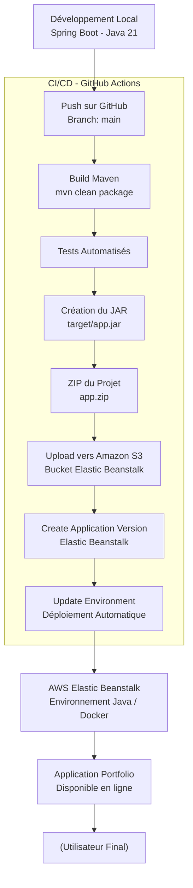
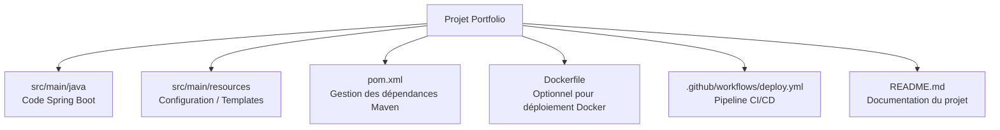

#Portfolio – Spring Boot (Java 21) | AWS Elastic Beanstalk | CI/CD GitHub Actions


Ce projet est un portfolio personnel développé avec Spring Boot (Java 21), intégrant la génération de PDF via iTextPDF, et déployé automatiquement sur AWS Elastic Beanstalk grâce à une pipeline CI/CD GitHub Actions.

L'objectif est de présenter mes compétences techniques, notamment en développement backend, en architecture cloud moderne et en automatisation avec CI/CD.




##Fonctionnalités principales

- Développé avec Spring Boot 3 / Java 21
- Expositions d’API REST pour les sections du portfolio
- Génération de PDF (CV, documents, etc.) via iTextPDF
- Architecture propre et maintenable
- Déploiement automatisé via GitHub Actions
- Hébergement scalable sous AWS Elastic Beanstalk

##Technologies utilisées
###Backend

- Java 21
- Spring Boot 3
- iTextPDF
- Maven

###Cloud / DevOps
- AWS Elastic Beanstalk
- Amazon S3
- AWS CLI & EB CLI
- GitHub Actions

##Structure du projet


##Architecture Spring Boot interne
```mermaid
flowchart LR

    A[Controller<br/>Endpoints API] --> B[Service<br/>Logique Métier]
    B --> C[PDF Generator<br/>iTextPDF]
    B --> D[Repository<br/>Accès Données (optionnel)]
    A --> E[Models / DTO]
```

##Déploiement AWS Elastic Beanstalk
###Préparation AWS

- Créer une application Elastic Beanstalk
- Créer un environnement (Java ou Docker)
- Configurer un bucket S3 dédié
- Créer un utilisateur IAM CI/CD avec : AWSElasticBeanstalkFullAccess, AmazonS3FullAccess

```mermaid
| Secret                  | Description            |
| ----------------------- | ---------------------- |
| `AWS_ACCESS_KEY_ID`     | Clé IAM                |
| `AWS_SECRET_ACCESS_KEY` | Secret IAM             |
| `AWS_REGION`            | Exemple : `eu-west-3`  |
| `EB_APP_NAME`           | Nom Elastic Beanstalk  |
| `EB_ENV_NAME`           | Nom de l’environnement |
```
##Pipeline GitHub Actions (déploiement automatique)

```yaml
name: Deploy to AWS Elastic Beanstalk

on:
  push:
    branches: [ "main" ]

jobs:
  deploy:
    runs-on: ubuntu-latest

    steps:
      - name: Checkout repository
        uses: actions/checkout@v3

      - name: Set up JDK 21
        uses: actions/setup-java@v3
        with:
          java-version: '21'
          distribution: 'temurin'

      - name: Build with Maven
        run: mvn clean package -DskipTests

      - name: Install AWS CLI
        run: sudo apt-get install -y awscli zip

      - name: Create ZIP file for deployment
        run: zip -r app.zip .

      - name: Upload ZIP to S3
        run: |
          aws s3 cp app.zip s3://${{ secrets.EB_APP_NAME }}/app-v-${GITHUB_SHA}.zip

      - name: Deploy to Elastic Beanstalk
        run: |
          aws elasticbeanstalk create-application-version \
            --application-name "${{ secrets.EB_APP_NAME }}" \
            --version-label "v-${GITHUB_SHA}" \
            --source-bundle S3Bucket="${{ secrets.EB_APP_NAME }}",S3Key="app-v-${GITHUB_SHA}.zip"

          aws elasticbeanstalk update-environment \
            --environment-name "${{ secrets.EB_ENV_NAME }}" \
            --version-label "v-${GITHUB_SHA}"
```